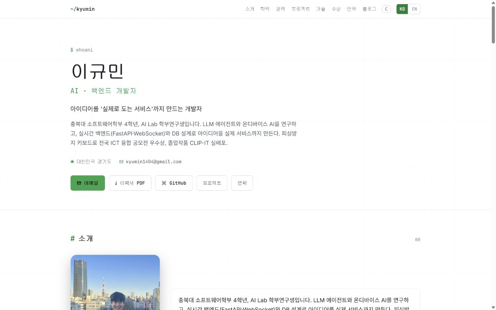
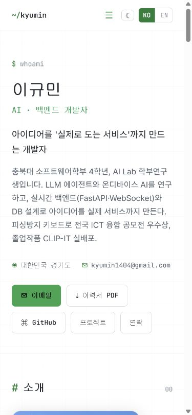
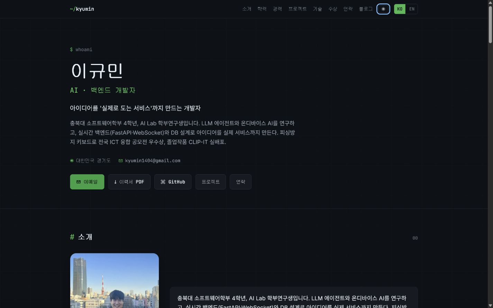

# Kyumin Lee Portfolio

개인 이력과 프로젝트를 정리한 GitHub Pages 포트폴리오입니다. 예전에 만들었던 사이트를 바탕으로, Vanilla JavaScript 과제에서 요구한 API 연동과 폼 검증, 반응형 화면을 추가했습니다.

- 사이트: https://dolphin1404.github.io/

## 실행 방법

별도의 설치나 빌드는 필요하지 않습니다.

```bash
python -m http.server 8000
```

- 한국어 페이지: http://localhost:8000/ko/
- 영어 페이지: http://localhost:8000/en/

## 이번에 추가한 내용

- GitHub API로 공개 저장소 불러오기
- API 로딩, 빈 결과, 오류와 재시도 화면
- 저장소 언어 필터
- 이름, 이메일, 메시지를 받는 Contact 폼과 입력 검사
- 모바일 메뉴의 키보드 조작과 초점 관리
- 테마 선택 저장과 ARIA 상태 표시
- 모바일 퍼스트 CSS와 `768px`, `1024px` 구간
- 프로필 이미지와 데스크톱·모바일 화면 캡처

기존 한국어·영어 페이지, 블로그와 관리자 편집기는 그대로 유지했습니다.

## 폴더

```text
index.html       브라우저 언어에 따라 /ko 또는 /en으로 이동
ko/ · en/        한국어·영어 포트폴리오와 블로그
admin/           콘텐츠 편집 화면
data/            이력과 블로그 데이터
assets/          CSS, JavaScript, 이력서 PDF
images/          프로필 이미지와 화면 캡처
```

자기소개와 프로젝트 내용은 `data/content.js`에서 관리합니다. 화면은 `assets/app.js`에서 만들고, 공통 상태와 메뉴는 `assets/common.js`, 테마는 `assets/features.js`에서 처리합니다.

## 구현 메모

### 화면 크기

작은 화면을 기본으로 작성한 뒤 두 구간에서 레이아웃을 넓혔습니다.

- `768px`: 햄버거 메뉴를 일반 메뉴로 바꾸고 About과 Contact를 2열로 배치
- `1024px`: 본문 여백과 저장소 카드의 최소 너비를 확대

메뉴처럼 한 방향으로 정렬하는 요소에는 Flexbox를 사용했습니다. 화면 폭에 따라 행과 열이 함께 바뀌는 저장소 카드에는 Grid의 `auto-fit`과 `minmax()`를 사용했습니다.

### 상태 관리

공개 페이지의 상태는 `assets/common.js`에 있는 `STATE` 객체에서 관리합니다. 이벤트 처리 함수는 상태를 바꾼 뒤 필요한 렌더 함수만 호출합니다.

| 동작 | 바뀌는 상태 | 화면을 갱신하는 함수 |
|---|---|---|
| 테마 변경 | `STATE.theme` | `renderTheme()` |
| 모바일 메뉴 열기·닫기 | `STATE.menuOpen` | `renderMenu()` |
| 저장소 요청 | `STATE.projects` | `renderProjects()` |
| 언어 필터 선택 | `STATE.projects.filter` | `renderProjects()` |
| Contact 입력·제출 | `STATE.form` | `renderForm()` |
| 페이지 스크롤 | `STATE.scroll` | `renderScrollState()` |

### GitHub API

`loadGithubProjects()`에서 `async/await`와 `try/catch`로 GitHub 저장소를 요청합니다. 요청 중에는 로딩 화면을 보여 주고, 결과가 없으면 빈 상태를 표시합니다. 네트워크 오류나 비정상 응답에는 재시도 버튼을 표시하며, 403 응답은 API 요청 한도 안내로 구분합니다.

저장소 배열은 다음과 같이 처리했습니다.

- `filter()`: fork·보관 저장소 제외, 선택한 언어 적용
- `map()`: 저장소 데이터를 카드 HTML로 변경
- `forEach()`: 입력 필드와 버튼 이벤트 연결

### 폼과 접근성

Contact 폼은 빈 값과 이메일 형식을 확인합니다. 오류는 입력란 아래에 표시하고 `aria-invalid`도 함께 변경합니다. 실제 이메일 전송 서비스는 연결하지 않았습니다.

테마와 필터 버튼에는 `aria-pressed`, 메뉴 버튼에는 `aria-expanded`를 사용했습니다. 모바일 메뉴는 Escape로 닫을 수 있고, 닫힌 뒤 초점이 메뉴 버튼으로 돌아옵니다. `prefers-reduced-motion`이 설정된 환경에서는 등장 애니메이션과 부드러운 스크롤을 줄입니다.

## 화면

| 데스크톱 | 모바일 |
|---|---|
|  |  |


